

  <strong>🧠 MediVision AI — Future Model Architecture</strong>

  <em>OpenMEDLab Foundation Models + MixFormer (CVPR 2022 SOTA) Integration Blueprint</em>

  
  
  
  

> **⚠️ STATUS: ARCHITECTURE ONLY — NOT IMPLEMENTED YET**
>
> This document details the planned integration of **OpenMEDLab foundation models** and **MixFormer (CVPR 2022 SOTA)** into MediVision AI. These models are **not yet implemented** in the codebase. This serves as the architectural blueprint for future integration.

---

## 📋 Table of Contents

- [Overview](#-overview)
- [OpenMEDLab Foundation Models](#-openmedlab-foundation-models)
  - [Platform Architecture](#platform-architecture)
  - [SAM-Med2D](#sam-med2d---2d-medical-image-segmentation)
  - [SAM-Med3D](#sam-med3d---3d-volumetric-segmentation)
  - [RETFound](#retfound---retinal-foundation-model)
  - [Endo-FM](#endo-fm---endoscopy-video-foundation-model)
  - [PULSE](#pulse---medical-language-model)
  - [MIS-FM](#mis-fm---3d-ct-segmentation)
- [MixFormer — CVPR 2022 SOTA](#-mixformer--cvpr-2022-sota)
  - [Core Architecture](#core-architecture)
  - [Mixed Attention Module (MAM)](#mixed-attention-module-mam)
  - [Backbone Variants](#backbone-variants)
  - [Localization Head](#localization-head)
  - [Performance Benchmarks](#performance-benchmarks)
- [Combined Integration Plan](#-combined-integration-plan)
- [Proposed Pipeline](#-proposed-medivision-ai-enhanced-pipeline)
- [Comparison: Current vs. Planned](#-comparison-current-vs-planned)
- [Research References](#-research-references)

---

## 🌟 Overview

MediVision AI currently uses **Roboflow YOLO models** for medical image detection. The planned upgrade will integrate:

1. **OpenMEDLab Foundation Models** — Pre-trained medical-specific foundation models for segmentation, language understanding, retinal analysis, and endoscopy, providing far deeper medical understanding than generic detection.
2. **MixFormer (CVPR 2022)** — State-of-the-art transformer-based tracking architecture using Mixed Attention Modules for real-time lesion tracking and temporal analysis during live consultations.

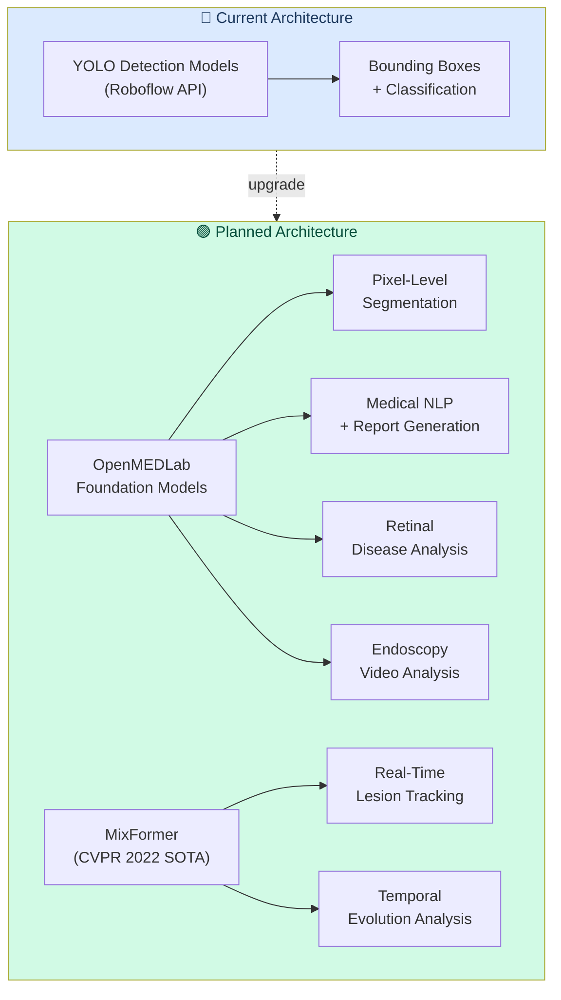

---

## 🏥 OpenMEDLab Foundation Models

### Platform Architecture

OpenMEDLab is an open-source platform from Shanghai AI Laboratory providing medical foundation models pre-trained on massive de-identified medical datasets via self-supervised learning.

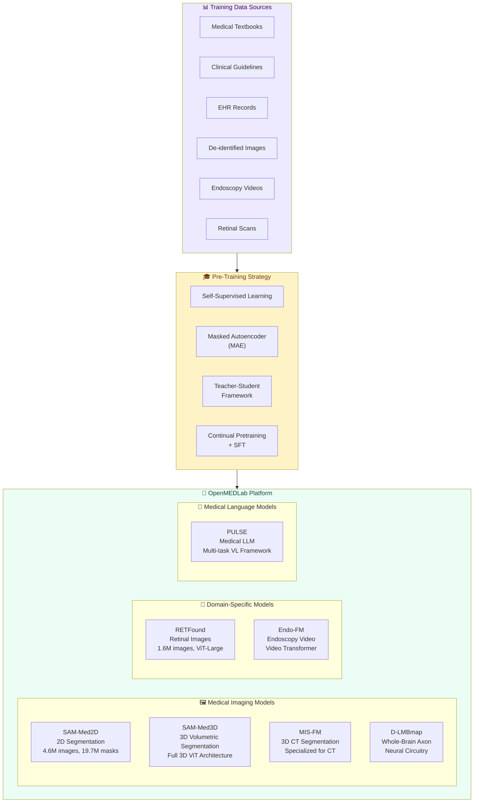

---

### SAM-Med2D — 2D Medical Image Segmentation

**Based on:** Segment Anything Model (SAM), fine-tuned on SA-Med2D-20M dataset

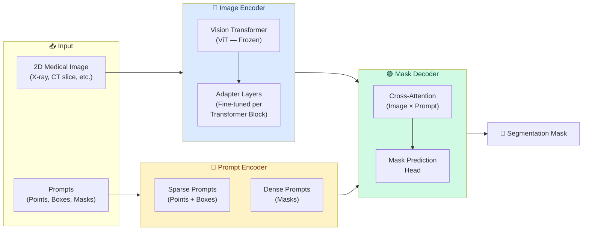

| Specification | Details |
|--------------|---------|
| **Base Model** | Segment Anything Model (SAM) |
| **Encoder** | ViT (frozen) + Learnable Adapter Layers |
| **Training Data** | SA-Med2D-20M: 4.6M images, 19.7M masks |
| **Prompt Types** | Points, bounding boxes, dense masks |
| **Fine-tuned Components** | Adapter layers, prompt encoder, mask decoder |
| **Modalities** | X-ray, CT, MRI, ultrasound, endoscopy, dermoscopy |

---

### SAM-Med3D — 3D Volumetric Segmentation

**Architecture:** Fully native 3D — not adapted from 2D

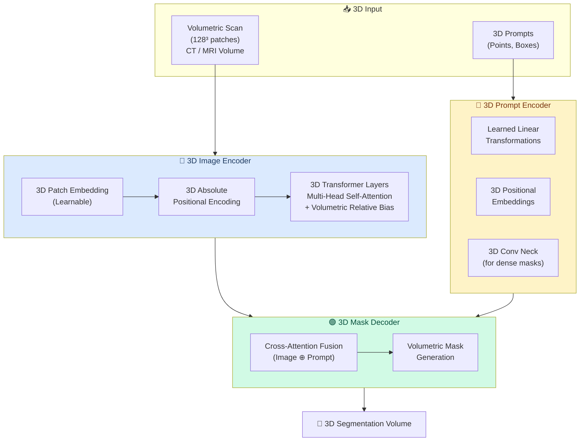

---

### RETFound — Retinal Foundation Model

**Pre-trained on:** 1.6M retinal images using Masked Autoencoder (MAE)

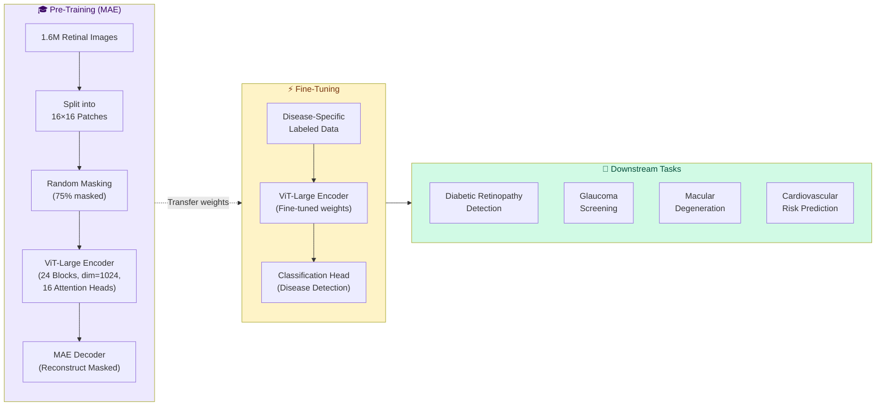

| Specification | Details |
|--------------|---------|
| **Architecture** | ViT-Large (24 transformer blocks) |
| **Embedding Dim** | 1024 |
| **Attention Heads** | 16 |
| **Patch Size** | 16 × 16 |
| **Pre-training Data** | 1.6M unlabeled retinal images |
| **Pre-training Method** | Masked Autoencoder (MAE) |
| **Downstream Tasks** | DR, glaucoma, AMD, cardiovascular risk |

---

### Endo-FM — Endoscopy Video Foundation Model

**Architecture:** Video Transformer with dynamic spatial-temporal positional encoding

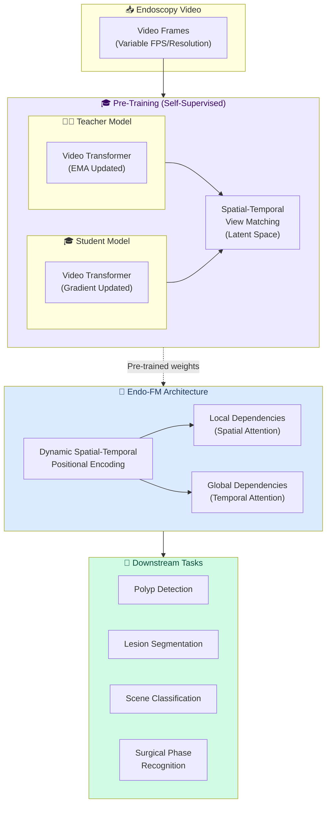

---

### PULSE — Medical Language Model

**Type:** Multi-task Vision-Language framework

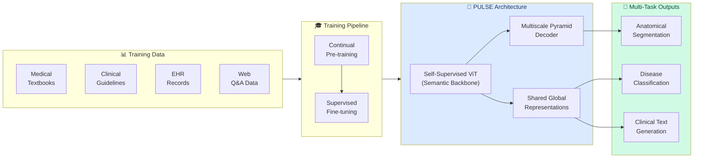

---

### MIS-FM — 3D CT Segmentation

| Specification | Details |
|--------------|---------|
| **Task** | 3D CT volumetric segmentation |
| **Input** | Full 3D CT scans |
| **Approach** | Foundation model specialized for CT modality |
| **Targets** | Organ segmentation, lesion delineation, anatomical structures |

---

## ⚡ MixFormer — CVPR 2022 SOTA

### Core Architecture

> **Paper:** *"MixFormer: End-to-End Tracking with Iterative Mixed Attention"*
> **Venue:** CVPR 2022 (Oral Presentation)
> **Key Innovation:** Unified feature extraction + target integration via Mixed Attention Module (MAM)

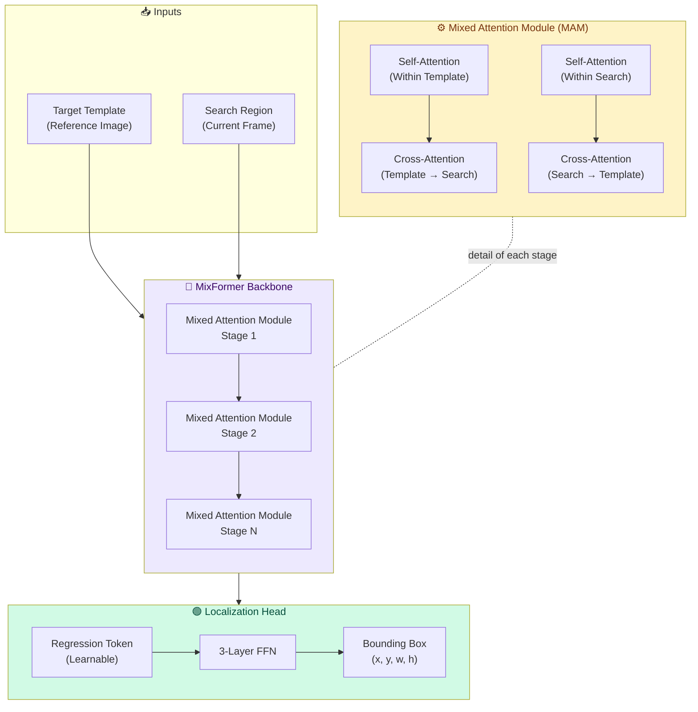

### Mixed Attention Module (MAM)

The core innovation — **simultaneous feature extraction + target-search integration** in a single module.

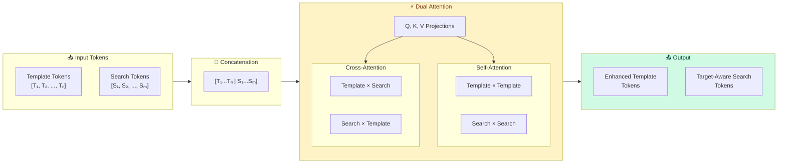

**How MAM works:**
1. Template and search tokens are **concatenated** into a single sequence
2. **Self-attention** captures intra-image features (template features + search features independently)
3. **Cross-attention** enables information flow between template and search (target-aware feature extraction)
4. Both happen **simultaneously** in a single attention operation — the key innovation
5. This replaces the traditional separate "extract features → then correlate" pipeline

---

### Backbone Variants

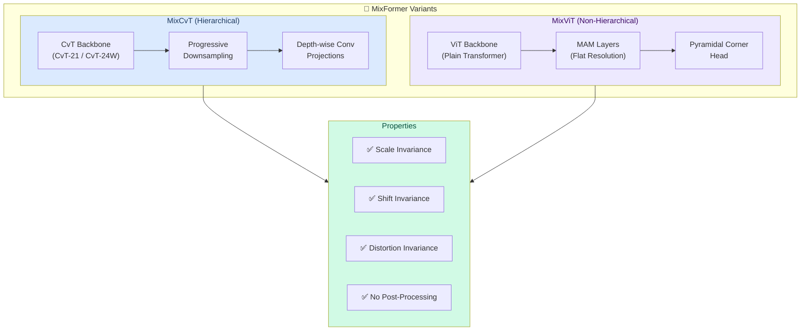

| Variant | Backbone | Type | Init Weights | Key Feature |
|---------|----------|------|-------------|-------------|
| **MixCvT** | CvT-21 / CvT-24W | Hierarchical | ImageNet pre-trained | Progressive downsampling + depth-wise conv |
| **MixViT** | ViT-Base / ViT-Large | Non-Hierarchical | MAE pre-trained | Flat resolution + pyramidal corner head |
| **MixViT-L** | ViT-Large | Non-Hierarchical | MAE pre-trained | Largest model, best accuracy |

### Localization Head

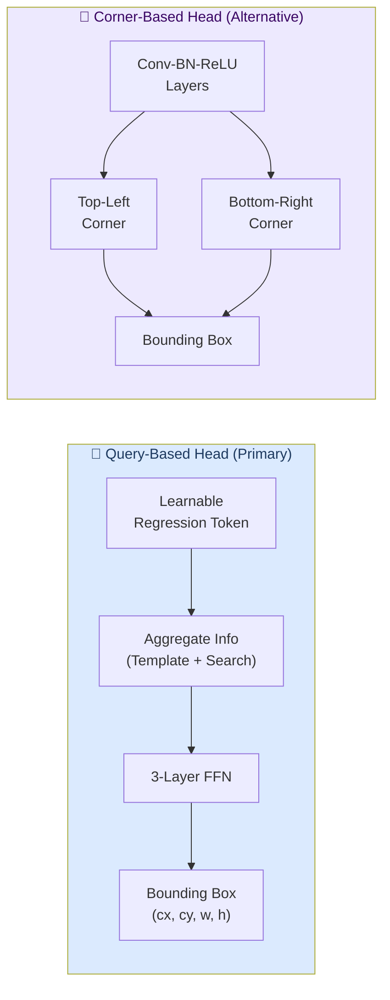

- **Query-based:** DETR-inspired learnable regression token → FFN → direct bbox regression → **no post-processing needed**
- **Corner-based:** STARK-inspired conv layers → estimate top-left/bottom-right corners

### Performance Benchmarks

| Benchmark | Metric | MixViT-L Score | Rank |
|-----------|--------|---------------|------|
| **LaSOT** | AUC | **73.3%** | 🥇 SOTA |
| **TrackingNet** | AUC | **86.1%** | 🥇 SOTA |
| **VOT2020** | EAO | **0.584** | 🥇 SOTA |
| **GOT-10k** | AO | — | Top-tier |
| **OTB100** | AUC | — | Top-tier |
| **UAV123** | AUC | — | Top-tier |
| **VOT2022-STb** | Rank | **1/41** | 🥇 #1 |

---

## 🔗 Combined Integration Plan

### How OpenMed + MixFormer Enhance MediVision AI

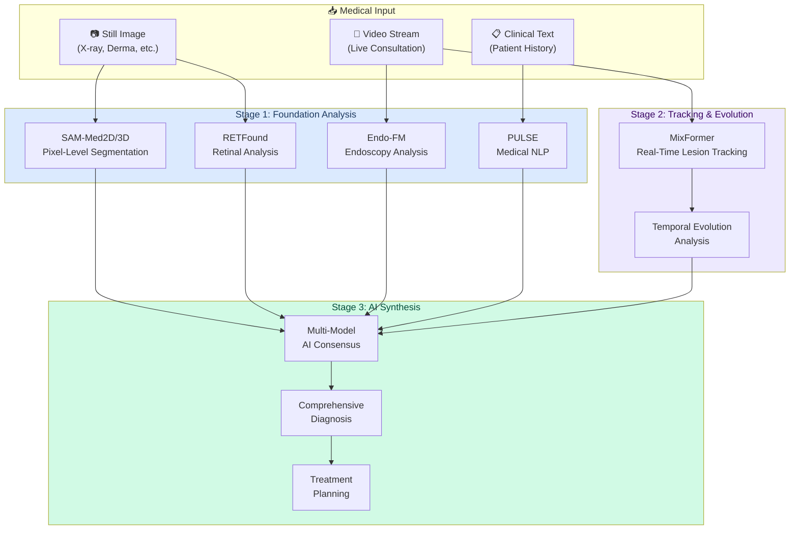

---

## 🏭 Proposed MediVision AI Enhanced Pipeline

### End-to-End Processing Flow

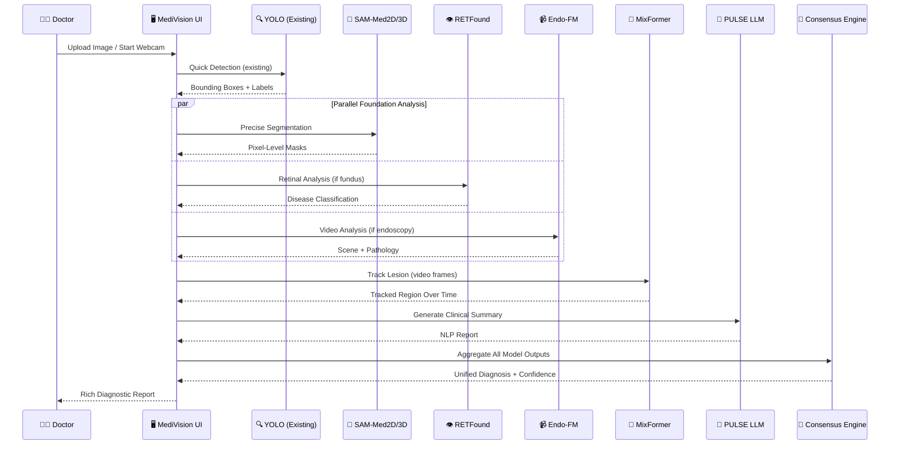

---

## 📊 Comparison: Current vs. Planned

| Capability | Current (YOLO) | Planned (OpenMed + MixFormer) |
|-----------|---------------|-------------------------------|
| **Detection** | Bounding box classification | ✅ + Pixel-level segmentation |
| **Segmentation** | ❌ Not supported | ✅ SAM-Med2D/3D |
| **3D Volume Analysis** | ❌ Not supported | ✅ SAM-Med3D |
| **Retinal Specialist** | Generic eye model | ✅ RETFound (1.6M images) |
| **Video Analysis** | Frame-by-frame YOLO | ✅ Endo-FM + MixFormer |
| **Real-Time Tracking** | ❌ No tracking | ✅ MixFormer MAM |
| **Temporal Evolution** | Manual comparison | ✅ Automated with MixFormer |
| **Medical NLP** | OpenAI (general) | ✅ PULSE (medical-specific) |
| **Pre-training Data** | Limited per model | ✅ Millions of medical images |
| **Post-Processing** | Required | ✅ End-to-end (MixFormer) |

---

## 📚 Research References

| Model | Paper | Venue | Repository |
|-------|-------|-------|-----------|
| **OpenMEDLab** | Platform for Medical Foundation Models | — | [github.com/openmedlab](https://github.com/openmedlab) |
| **SAM-Med2D** | SAM-Med2D: Medical Image Segmentation | arXiv 2023 | [github.com/openmedlab/SAM-Med2D](https://github.com/openmedlab/SAM-Med2D) |
| **SAM-Med3D** | SAM-Med3D: Volumetric Medical Image Segmentation | arXiv 2023 | [github.com/openmedlab/SAM-Med3D](https://github.com/openmedlab/SAM-Med3D) |
| **RETFound** | A foundation model for generalizable disease detection from retinal images | Nature 2023 | [github.com/rmaphoh/RETFound_MAE](https://github.com/rmaphoh/RETFound_MAE) |
| **Endo-FM** | Foundation Model for Endoscopy Video Analysis | arXiv 2023 | [github.com/openmedlab/Endo-FM](https://github.com/openmedlab/Endo-FM) |
| **PULSE** | Medical Large Language Model | arXiv 2023 | [github.com/openmedlab/PULSE](https://github.com/openmedlab/PULSE) |
| **MixFormer** | End-to-End Tracking with Iterative Mixed Attention | **CVPR 2022 (Oral)** | [github.com/MCG-NJU/MixFormer](https://github.com/MCG-NJU/MixFormer) |

---

  <strong>📋 This is an architecture document only — Implementation pending</strong>

  <em>MediVision AI — Advancing Healthcare with Foundation Models</em>

