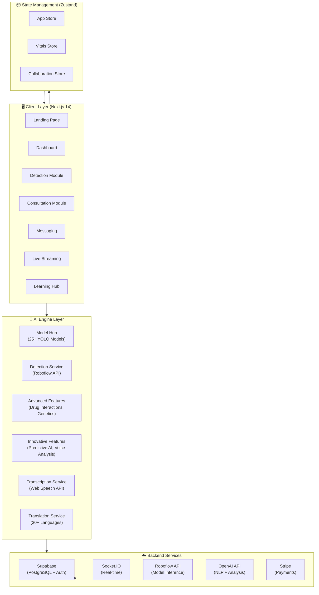
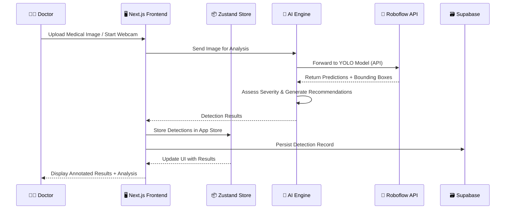
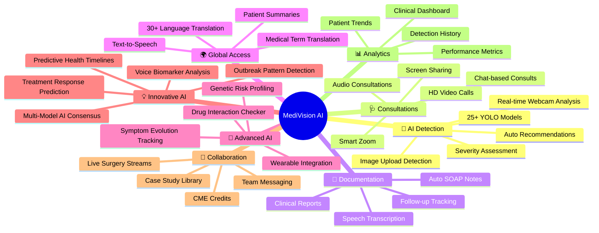
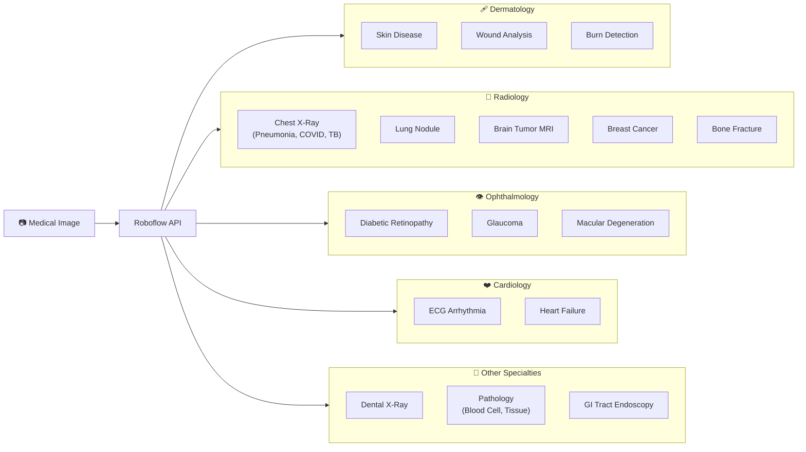
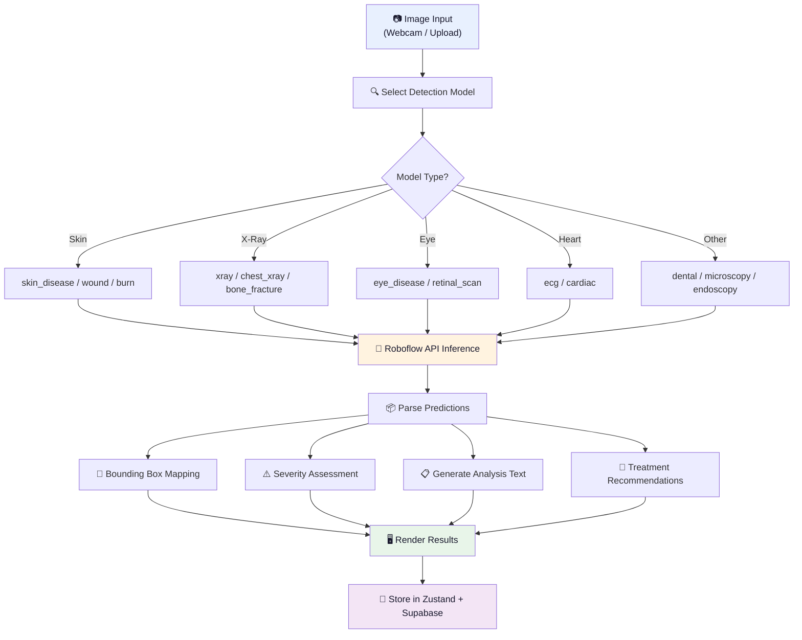
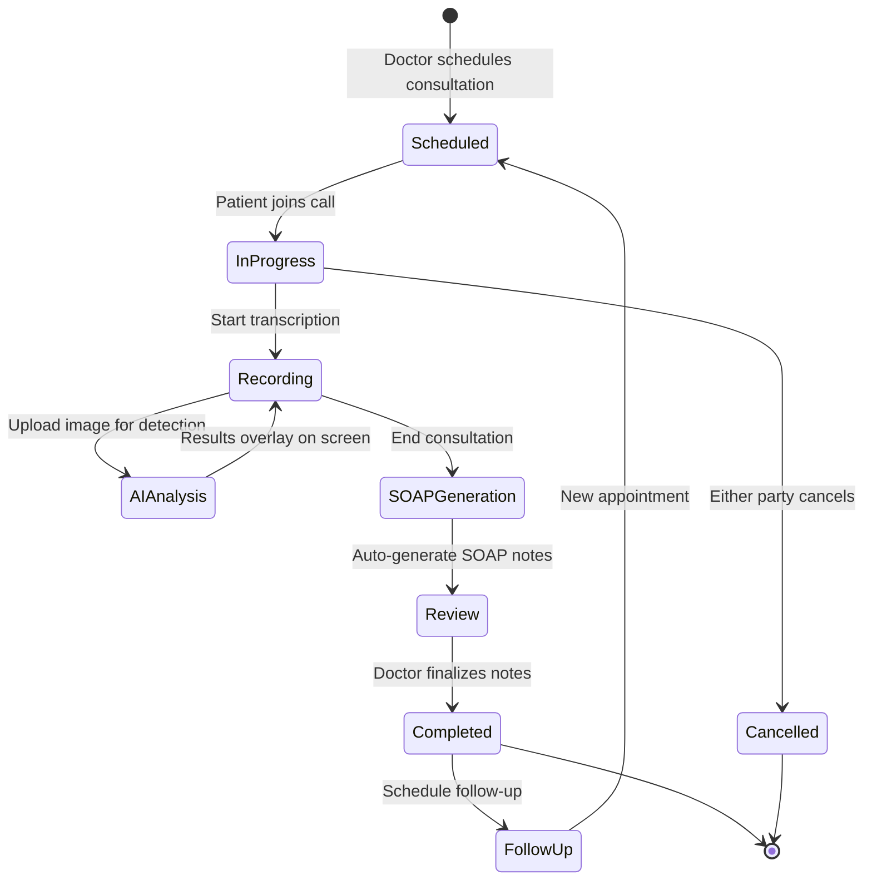
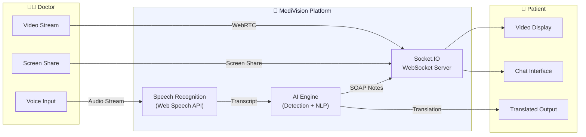
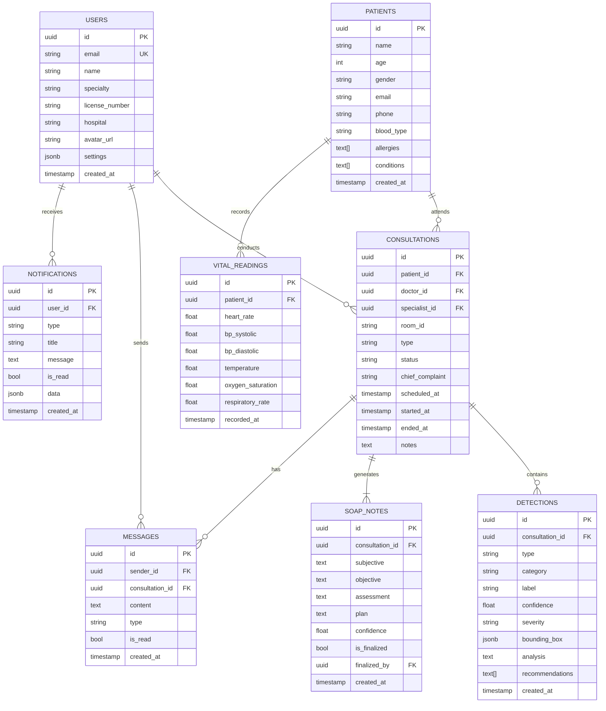
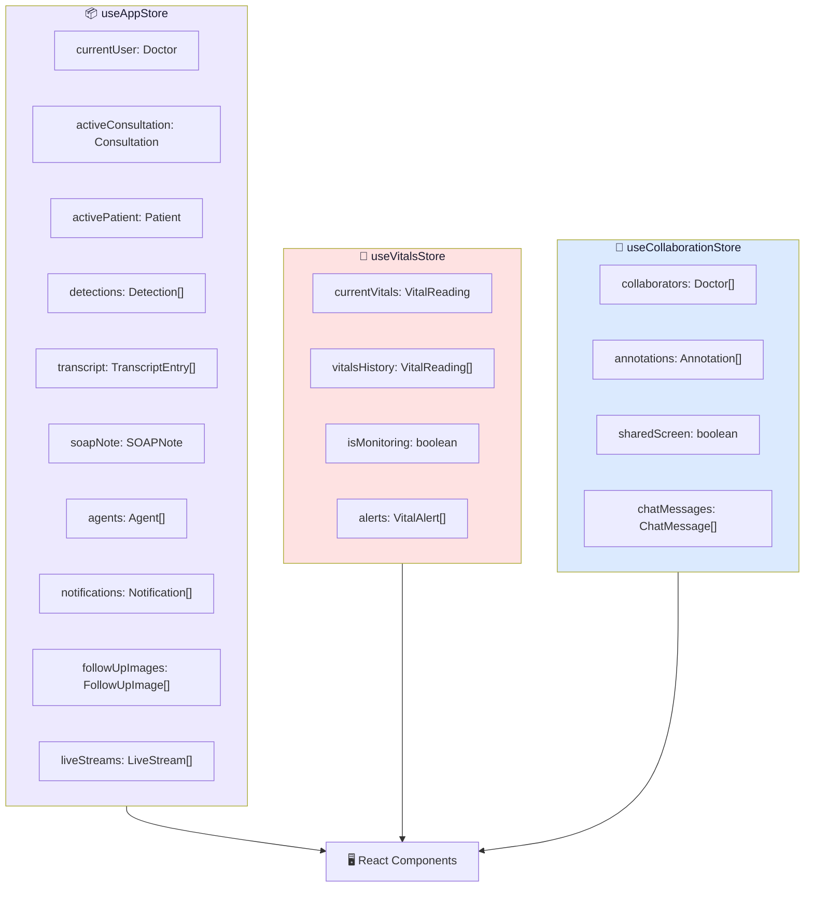

<p align="center">
  <strong>🏥 MediVision AI</strong>
</p>

<p align="center">
  <em>AI-Powered Clinical Collaboration Platform for Every Healthcare Need</em>
</p>

<p align="center">
  
  
  
  
  
  
  
</p>

---

## 📋 Table of Contents

- [Overview](#-overview)
- [Key Statistics](#-key-statistics)
- [Architecture](#-architecture)
- [Feature Breakdown](#-feature-breakdown)
- [AI Detection Pipeline](#-ai-detection-pipeline)
- [Medical AI Model Hub](#-medical-ai-model-hub)
- [Data Flow](#-data-flow)
- [Tech Stack](#-tech-stack)
- [Project Structure](#-project-structure)
- [Database Schema](#-database-schema)
- [State Management](#-state-management)
- [Getting Started](#-getting-started)
- [Environment Variables](#-environment-variables)
- [API Routes](#-api-routes)
- [Pages & Routes](#-pages--routes)
- [Contributing](#-contributing)

---

## 🌟 Overview

**MediVision AI** is a comprehensive, AI-powered clinical collaboration platform built with Next.js 14. It enables healthcare professionals to perform real-time medical image analysis using 25+ specialized YOLO models, conduct HD telemedicine consultations, auto-generate SOAP notes from speech transcription, and collaborate globally across 30+ languages.

> _"The future of clinical collaboration — Create. Diagnose. Heal. Together."_

---

## 📊 Key Statistics

| Metric | Value |
|--------|-------|
| 🤖 AI Models | **25+** specialized YOLO models |
| 🎯 Detection Accuracy | **98.5%** average across models |
| 🌍 Languages Supported | **30+** for real-time translation |
| 🏥 Medical Specialties | **8** (Dermatology, Radiology, Ophthalmology, Cardiology, Dental, Pathology, Gastroenterology, Neurology) |
| 📱 Application Pages | **18+** feature-rich routes |
| 🗃️ Database Tables | **8+** (users, patients, consultations, detections, messages, etc.) |

---

## 🏗 Architecture

### High-Level System Architecture



### Request Flow Architecture



---

## 🧩 Feature Breakdown

### Core Features Map



### Feature Details

| Feature | Description | Module |
|---------|-------------|--------|
| **Real-Time AI Detection** | Live webcam analysis using specialized YOLO models with bounding box overlay | `detection.ts` |
| **Model Hub** | 25+ medical AI models across 8 specialties with Roboflow cloud inference | `model-hub.ts` |
| **Auto SOAP Notes** | AI-generated Subjective, Objective, Assessment, Plan notes from transcription | `transcription.ts` |
| **Drug Interaction Checker** | Analyzes medication combinations for interactions, alternatives, and food conflicts | `advanced-features.ts` |
| **Symptom Evolution Tracking** | Tracks condition progression over time using image comparisons | `advanced-features.ts` |
| **Genetic Risk Profiling** | Analyzes genetic markers for disease risk and pharmacogenomics | `advanced-features.ts` |
| **Wearable Data Integration** | Connects smartwatches, glucose monitors, BP monitors, ECG devices | `advanced-features.ts` |
| **Predictive Health Timelines** | AI-generated disease progression predictions with modifiable factors | `innovative-features.ts` |
| **Voice Biomarker Analysis** | Detects health indicators from voice patterns (tremor, breathlessness) | `innovative-features.ts` |
| **Multi-Model AI Consensus** | Aggregates opinions from multiple AI models for robust diagnosis | `innovative-features.ts` |
| **Outbreak Pattern Detection** | Epidemiological analysis with regional hotspots and spread predictions | `innovative-features.ts` |
| **Treatment Response Prediction** | Predicts treatment success probability and patient compatibility | `innovative-features.ts` |
| **30+ Language Translation** | Real-time medical term translation with Text-to-Speech for patients | `translation.ts` |
| **Live Surgery Streaming** | Watch live procedures with annotations, Q&A, and chat | `live/page.tsx` |
| **Messaging System** | Real-time chat with doctors, groups, call initiation, and file sharing | `messages/page.tsx` |

---

## 🔬 AI Detection Pipeline

### Detection Model Categories



### Detection Processing Flow



---

## 🧠 Medical AI Model Hub

### Available Models (25+)

| # | Model Name | Category | Classes | Accuracy |
|---|-----------|----------|---------|----------|
| 1 | Skin Lesion Classifier | Dermatology | acne, eczema, psoriasis, rosacea, dermatitis, fungal | 87% |
| 2 | Wound Analysis | Dermatology | wound, infected, healing, chronic, surgical | 85% |
| 3 | Burn Classification | Dermatology | first_degree, second_degree, third_degree, chemical | 86% |
| 4 | Pneumonia Detection | Radiology | pneumonia, normal, viral, bacterial | 92% |
| 5 | TB Detection | Radiology | tuberculosis, normal, suspected | 90% |
| 6 | Lung Nodule Detection | Radiology | nodule, benign, malignant, suspicious | 88% |
| 7 | Brain Tumor MRI | Radiology | glioma, meningioma, pituitary, no_tumor | 93% |
| 8 | Breast Cancer Detection | Radiology | benign, malignant, normal, suspicious | 91% |
| 9 | Bone Fracture Detection | Radiology | fracture, hairline, displaced, normal | 89% |
| 10 | Diabetic Retinopathy | Ophthalmology | no_dr, mild, moderate, severe, proliferative | 89% |
| 11 | Glaucoma Detection | Ophthalmology | glaucoma, suspect, normal | 87% |
| 12 | Macular Degeneration | Ophthalmology | dry_amd, wet_amd, normal, drusen | 86% |
| 13 | Dental X-Ray Analysis | Dental | cavity, root_canal, impacted, periodontal, normal | 88% |
| 14 | ECG Arrhythmia Detection | Cardiology | normal, afib, vtach, bradycardia, tachycardia | 91% |
| 15 | Blood Cell Analysis | Pathology | wbc_elevated, rbc_abnormal, platelets_low, normal | 89% |
| 16 | Tissue Analysis | Pathology | normal, benign, malignant, inflammatory | 87% |
| 17 | GI Disease Detection | Gastroenterology | ulcer, erosion, tumor, inflammation, normal | 85% |

> All models run via **Roboflow cloud API** — no local downloads required.

---

## 🔄 Data Flow

### Consultation Lifecycle



### Real-Time Communication Flow



---

## 🛠 Tech Stack

### Frontend
| Technology | Purpose |
|-----------|---------|
| **Next.js 14** | React framework with App Router |
| **TypeScript 5.5** | Type-safe development |
| **Tailwind CSS 3.4** | Utility-first styling |
| **Framer Motion** | Animations and transitions |
| **Lucide React** | Modern icon library |
| **Recharts + Chart.js** | Data visualization and analytics |
| **React Webcam** | Camera access for AI detection |
| **React Markdown** | Rendering markdown content |
| **React Hot Toast** | Notification toasts |

### Backend & Services
| Technology | Purpose |
|-----------|---------|
| **Supabase** | PostgreSQL database + Auth + Realtime subscriptions |
| **Socket.IO** | WebSocket real-time communication |
| **OpenAI API** | NLP, analysis, and AI-generated text |
| **Roboflow API** | YOLO model inference (cloud-based) |
| **Stripe** | Payment processing |
| **Web Speech API** | Browser-native speech recognition |

### State & Data
| Technology | Purpose |
|-----------|---------|
| **Zustand** | Lightweight global state management |
| **SWR** | Data fetching with caching |
| **Zod** | Schema validation |
| **Axios** | HTTP client |
| **date-fns** | Date utilities |
| **UUID** | Unique identifier generation |

---

## 📁 Project Structure

```
mini/
├── src/
│   ├── app/                         # Next.js App Router pages
│   │   ├── page.tsx                 # 🏠 Landing page (hero, features, CTA)
│   │   ├── layout.tsx               # Root layout with metadata
│   │   ├── globals.css              # Global styles + design system
│   │   ├── login/page.tsx           # 🔐 Authentication page
│   │   ├── dashboard/page.tsx       # 📊 Main dashboard
│   │   ├── detection/page.tsx       # 🔬 AI detection interface
│   │   ├── consultation/page.tsx    # 📋 Single consultation view
│   │   ├── consultations/page.tsx   # 📋 Consultations list
│   │   ├── patients/page.tsx        # 👥 Patient management
│   │   ├── messages/page.tsx        # 💬 Messaging system
│   │   ├── models/page.tsx          # 🧠 AI Model Hub browser
│   │   ├── analytics/page.tsx       # 📈 Analytics dashboard
│   │   ├── schedule/page.tsx        # 📅 Appointment scheduling
│   │   ├── documents/page.tsx       # 📄 Clinical documents
│   │   ├── live/page.tsx            # 🔴 Live streaming
│   │   ├── learn/page.tsx           # 📚 Learning & case studies
│   │   ├── team/page.tsx            # 👥 Team management
│   │   ├── profile/page.tsx         # 👤 Doctor profile
│   │   ├── settings/page.tsx        # ⚙️ App settings
│   │   ├── notifications/page.tsx   # 🔔 Notifications center
│   │   └── api/                     # API routes
│   │       ├── consultations/       # Consultation CRUD
│   │       ├── detection/           # AI detection endpoints
│   │       ├── models/              # Model management
│   │       ├── patients/            # Patient data
│   │       └── soap/                # SOAP note generation
│   │
│   ├── lib/                         # Core library modules
│   │   ├── ai/                      # 🤖 AI engine modules
│   │   │   ├── detection.ts         # Detection models + VideoAnalyzer class
│   │   │   ├── model-hub.ts         # 25+ YOLO model definitions + Roboflow client
│   │   │   ├── advanced-features.ts # Drug interactions, genetics, wearables
│   │   │   ├── innovative-features.ts # Predictive AI, voice analysis, consensus
│   │   │   └── transcription.ts     # Speech recognition + SOAP note generation
│   │   ├── db/                      # Database layer
│   │   │   ├── supabase.ts          # Supabase client + auth helpers + subscriptions
│   │   │   └── auth.ts              # Authentication utilities
│   │   └── translation.ts          # 30+ language translation service
│   │
│   ├── store/                       # Zustand state stores
│   │   └── index.ts                 # App store, Vitals store, Collaboration store
│   │
│   └── types/                       # TypeScript type definitions
│       └── index.ts                 # Patient, Consultation, Detection, Doctor, etc.
│
├── package.json                     # Dependencies and scripts
├── next.config.js                   # Next.js configuration
├── tailwind.config.js               # Tailwind CSS configuration
├── tsconfig.json                    # TypeScript configuration
└── .env.local                       # Environment variables (not committed)
```

---

## 🗃 Database Schema

### Entity Relationship Diagram



---

## 📦 State Management

### Zustand Store Architecture



---

## 🚀 Getting Started

### Prerequisites

- **Node.js** >= 18.0
- **npm** or **yarn**
- **Supabase** account (for database + auth)
- **Roboflow** API key (for AI model inference)
- **OpenAI** API key (for NLP features)

### Installation

```bash
# 1. Clone the repository
git clone <repository-url>
cd mini

# 2. Install dependencies
npm install

# 3. Set up environment variables
cp .env.example .env.local
# Edit .env.local with your API keys (see Environment Variables section)

# 4. Run the development server
npm run dev

# 5. Open in browser
# Navigate to http://localhost:3000
```

### Build for Production

```bash
# Build
npm run build

# Start production server
npm start
```

---

## 🔑 Environment Variables

Create a `.env.local` file in the root directory with the following variables:

```env
# Supabase
NEXT_PUBLIC_SUPABASE_URL=your_supabase_project_url
NEXT_PUBLIC_SUPABASE_ANON_KEY=your_supabase_anon_key
SUPABASE_SERVICE_ROLE_KEY=your_supabase_service_role_key

# Roboflow (AI Model Inference)
NEXT_PUBLIC_ROBOFLOW_API_KEY=your_roboflow_api_key

# OpenAI
OPENAI_API_KEY=your_openai_api_key

# Stripe (Payments)
NEXT_PUBLIC_STRIPE_PUBLISHABLE_KEY=your_stripe_publishable_key
STRIPE_SECRET_KEY=your_stripe_secret_key

# Socket.IO (Real-time)
NEXT_PUBLIC_SOCKET_URL=your_socket_server_url
```

> ⚠️ **Note:** The app includes a mock client for development without Supabase credentials.

---

## 🛣 API Routes

| Route | Method | Description |
|-------|--------|-------------|
| `/api/consultations` | GET, POST | List / create consultations |
| `/api/detection` | POST | Run AI detection on an image |
| `/api/models` | GET | List available AI models |
| `/api/patients` | GET, POST | Patient CRUD operations |
| `/api/soap` | POST | Generate SOAP notes from transcript |

---

## 📄 Pages & Routes

| Route | Page | Description |
|-------|------|-------------|
| `/` | Landing | Marketing page with features, AI models showcase, testimonials |
| `/login` | Auth | Sign in / register with Supabase Auth |
| `/dashboard` | Dashboard | Main clinical dashboard with quick actions |
| `/detection` | Detection | Real-time AI detection via webcam or image upload |
| `/consultation` | Consultation | Active consultation with video, AI, and transcription |
| `/consultations` | Consultations | Browse and manage all consultations |
| `/patients` | Patients | Patient records, vitals, and history |
| `/messages` | Messaging | Real-time chat with colleagues and groups |
| `/models` | Model Hub | Browse 25+ AI models by specialty |
| `/analytics` | Analytics | Clinical analytics and performance metrics |
| `/schedule` | Schedule | Appointment scheduling and calendar |
| `/documents` | Documents | Clinical documents and reports |
| `/live` | Live | Live surgery/procedure streaming |
| `/learn` | Learning | Case studies and educational content |
| `/team` | Team | Team management and collaboration |
| `/profile` | Profile | Doctor profile and credentials |
| `/settings` | Settings | App configuration and preferences |
| `/notifications` | Notifications | Notification center |

---

## 🌐 Supported Languages

The platform supports **30+ languages** for global healthcare access:

| Region | Languages |
|--------|-----------|
| 🌎 Americas | English, Spanish, Portuguese |
| 🌍 Europe | French, German, Dutch, Polish, Ukrainian, Russian, Turkish |
| 🌏 Asia | Hindi, Tamil, Telugu, Kannada, Malayalam, Punjabi, Urdu, Arabic, Chinese, Japanese, Korean, Vietnamese, Thai, Indonesian, Malay |
| 🌍 Africa | Swahili |
| 🌍 Middle East | Hebrew |

Each language includes:
- **Medical terminology translations** (diagnosis, treatment, medication, follow-up)
- **Patient-friendly explanations** in native language
- **Text-to-Speech** voice output for patient communication
- **Patient summary generation** with localized medical advice

---

## 🤝 Contributing

1. Fork the repository
2. Create a feature branch: `git checkout -b feature/amazing-feature`
3. Commit changes: `git commit -m 'feat: add amazing feature'`
4. Push to branch: `git push origin feature/amazing-feature`
5. Open a Pull Request

---

<p align="center">
  <strong>Built with ❤️ for the future of healthcare</strong>
</p>

<p align="center">
  <em>MediVision AI — Create. Diagnose. Heal. Together.</em>
</p>
